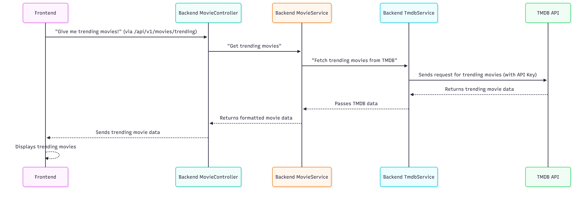

# Chapter 4: Third-Party Movie Data (TMDB)

Welcome back! In [Chapter 3: Frontend Data & State Management](03_frontend_data___state_management_.md), we learned how CinéConnect efficiently handles and displays dynamic information like movie lists and search results, making your browsing experience smooth and fast. But where does all that rich movie data actually come from? Does CinéConnect store every movie's poster, plot, and cast details itself?

## 📚 Your Gateway to a World of Movies: Why We Use TMDB

Imagine trying to maintain a complete database of *every* movie ever made, with up-to-date information, posters, trailers, and cast details. It would be a monumental task, constantly changing, and incredibly resource-intensive!

This is where "Third-Party Movie Data" comes in. CinéConnect doesn't try to reinvent the wheel. Instead, it acts like a smart librarian, knowing exactly where to find the most comprehensive and up-to-date movie information online.

**Our main goal in this chapter is to understand how CinéConnect leverages a massive external movie database called `TMDB` (The Movie Database) to access a rich and up-to-date catalog of films without storing all that data directly.**

Let's explore the key players in this process.

## The Experts: `TMDB` and Our `TmdbService`

Think of it like this:

1.  **`TMDB` (The Movie Database) - The Grand Encyclopedia**:
    *   This is a colossal online encyclopedia dedicated solely to movies and TV shows. It contains details about millions of films, including release dates, plots, cast and crew, trailers, posters, genres, and much more.
    *   It's constantly updated by a community of movie enthusiasts and official sources, making it a reliable and comprehensive resource.

2.  **`TmdbService` (Our App's Translator) - The Specialized Librarian**:
    *   Our CinéConnect application doesn't talk directly to TMDB from the frontend. Instead, our backend has a dedicated `TmdbService`.
    *   This `TmdbService` acts as a `bridge` or `translator`. When CinéConnect needs movie information (like "trending movies" or "details for a specific film"), it asks our `TmdbService`.
    *   The `TmdbService` then knows how to send the correct "questions" (requests) to TMDB's official API, understand TMDB's "answers" (responses), and handle any issues that might come up (like TMDB being temporarily unavailable).

## How CinéConnect Gets Movie Data from TMDB

Let's trace what happens when you want to see a list of trending movies in CinéConnect.

### The User Experience

1.  You open CinéConnect and go to the Home page.
2.  The app needs to display a list of current trending movies.
3.  The trending movies appear on your screen, complete with titles, posters, and ratings.

### Behind the Scenes: A Collaborative Effort

Here's how CinéConnect works with TMDB to get that trending movie list:



1.  **Frontend Request**: Your CinéConnect frontend (using `useMovieList` and `moviesService`, as we saw in [Chapter 3: Frontend Data & State Management](03_frontend_data___state_management_.md)) sends a request to our backend at `/api/v1/movies/trending`.
2.  **Backend Controller**: The `MovieController` in our backend receives this request. Its job is to figure out which service can handle it.
3.  **Backend MovieService**: The `MovieController` passes the request to the main `MovieService`. This service handles all movie-related business logic, including fetching details.
4.  **Backend TmdbService**: Crucially, the `MovieService` doesn't fetch the data itself. Instead, it tells the `TmdbService`: "Go ask TMDB for the trending movies!"
5.  **`TmdbService` to TMDB API**: The `TmdbService` constructs a proper request to the `TMDB API`, including our special `TMDB_API_KEY` (a secret password that identifies our application to TMDB).
6.  **TMDB API Responds**: TMDB processes the request and sends back the trending movie data.
7.  **Data Flow Back**: The data then flows back through `TmdbService` -> `MovieService` -> `MovieController` -> and finally to your `Frontend`, which displays it beautifully.

## Diving into the Code: How `TmdbService` Works

Let's look at the actual code that makes our `TmdbService` function as this specialized librarian.

### 1. Frontend Calls Our Backend Service

First, let's revisit how the frontend initiates the request. In [Chapter 3: Frontend Data & State Management](03_frontend_data___state_management_.md), `useMovieList` calls `moviesService.getTrending()`.

```typescript
// apps/frontend/src/service/movies.service.ts (Simplified)
import { apiClient } from "../lib/api-client"; // Our client to talk to OUR backend

export const moviesService = {
  getTrending: (page = 1) =>
    apiClient.get<TrendingResponse>(`/api/v1/movies/trending?page=${page}`),
  // ... other movie fetching methods
};
```
This `moviesService.getTrending()` method simply makes an HTTP `GET` request to our *own* backend at `/api/v1/movies/trending`.

### 2. Our Backend Controller Receives the Request

The request then hits our backend's `MovieController`:

```typescript
// apps/backend/src/controllers/movie.controller.ts (Simplified)
import { Request, Response } from "express";
import { success } from "../utils";
import { MovieService } from "../services/movie"; // Our core movie logic service

export const MovieController = {
    async getTrending(req: Request, res: Response) {
        // Parse the page number from the request (default to 1)
        const page = Math.max(1, parseInt(String(req.query.page ?? 1), 10) || 1);
        
        // Ask our MovieService to get the trending data
        const data = await MovieService.getTrending(page); 
        
        // Send the data back to the frontend
        return success(res, data);
    },
    // ... other controller methods
};
```
The `MovieController` takes the page number and then calls `MovieService.getTrending(page)`.

### 3. Our Backend `MovieService` Delegates to `TmdbService`

This is where the direct interaction with the `TmdbService` happens:

```typescript
// apps/backend/src/services/movie.ts (Simplified)
import { TmdbService } from "./tmdb.service"; // Our TMDB translator service

export const MovieService = {
    async getTrending(page: number) {
        // Ask the TmdbService to fetch trending movies
        const tmdbData = await TmdbService.getTrendingMovies(page);
        
        // You might do some processing here, like saving to our own DB, etc.
        // For now, we'll just return it directly.
        return tmdbData;
    },
    // ... other movie related business logic
};
```
As you can see, `MovieService.getTrending` simply calls `TmdbService.getTrendingMovies(page)`. This keeps our main `MovieService` clean and focused on business logic, leaving the external communication to `TmdbService`.

### 4. Our `TmdbService` Connects to the `TMDB API`

Finally, let's look at the core of our `TmdbService` that actually talks to TMDB.

```typescript
// apps/backend/src/services/tmdb.service.ts (Simplified)
import axios from 'axios'; // A popular library for making HTTP requests
import { badGateway, notFound } from '../utils'; // Custom error helpers
import { logger } from '../logger'; // For logging errors

// We get our secret API key from environment variables
const TMDB_API_KEY = process.env.TMDB_API_KEY; 
const TMDB_BASE_URL = 'https://api.themoviedb.org/3'; // TMDB's base address

// Create a special 'client' that already knows the base URL and API key
const tmdbClient = axios.create({
  baseURL: TMDB_BASE_URL,
  params: {
    api_key: TMDB_API_KEY, // Our secret password for TMDB
  },
});

// A helper function to handle common errors from TMDB
function handleTmdbError(error: unknown, context: string): never {
  if (axios.isAxiosError(error)) {
    if (error.response?.status === 404) {
      throw notFound('Movie not found'); // If TMDB says 404, we say "Movie not found"
    }
    if (error.response?.status === 401) {
      logger.error( // Log this secret key issue
        { context, status: 401 },
        'TMDB returned 401 — check TMDB_API_KEY is set and valid.'
      );
      throw badGateway('Movie database API key invalid or missing. Set a valid TMDB_API_KEY in .env.');
    }
  }
  logger.error({ context, err: error }, 'TMDB request failed');
  throw badGateway('Failed to fetch from movie database'); // Generic error
}

export const TmdbService = {
  // This function fetches trending movies from TMDB
  async getTrendingMovies(page = 1) {
    try {
      // Use our configured client to make a GET request to the trending endpoint
      const response = await tmdbClient.get('/trending/movie/day', {
        params: { page }, // Add the page number to the request
      });
      return response.data; // Return the data received from TMDB
    } catch (error) {
      // If anything goes wrong, our error handler takes over
      handleTmdbError(error, 'Error fetching trending movies');
    }
  },

  // This function fetches details for a specific movie by its ID
  async getMovieDetails(movieId: number) {
    try {
      const response = await tmdbClient.get(`/movie/${movieId}`);
      return response.data;
    } catch (error) {
      handleTmdbError(error, `Error fetching movie ${movieId}`);
    }
  },

  // This function searches for movies based on a query
  async searchMovies(query: string, page = 1) {
    try {
      const response = await tmdbClient.get('/search/movie', {
        params: { query, page },
      });
      return response.data;
    } catch (error) {
      handleTmdbError(error, 'Error searching movies');
    }
  },

  // ... other methods to fetch top-rated, discover by genre, etc.
};
```
Key things to note here:
*   **`TMDB_API_KEY`**: This is crucial! It's our application's unique identifier to TMDB, obtained when registering with their service. It's loaded from an environment variable (`.env` file) for security.
*   **`axios.create`**: We use `axios` to make HTTP requests. `axios.create` helps us set up a pre-configured client (`tmdbClient`) with the `TMDB_BASE_URL` and `api_key` already included, so we don't have to repeat them for every request.
*   **`getTrendingMovies`**: This function makes a `GET` request to TMDB's `/trending/movie/day` endpoint. TMDB automatically includes our `api_key` thanks to `tmdbClient`.
*   **`handleTmdbError`**: This function is a robust way to catch any errors from TMDB (like a movie not being found or our API key being invalid) and convert them into friendly error messages for our application.

This structured approach ensures that CinéConnect remains efficient, always has access to the latest movie information, and gracefully handles any issues that might arise when communicating with a third-party service.

## Conclusion

In this chapter, we've unlocked the secret to how CinéConnect accesses its vast movie library. We learned that instead of storing all that data itself, our app acts as a smart bridge to `TMDB` (The Movie Database), a massive online movie encyclopedia. The `TmdbService` in our backend plays the crucial role of communicating with TMDB, fetching trending films, search results, or specific movie details, and handling potential errors. This separation of concerns allows CinéConnect to be lightweight, always up-to-date, and focused on providing a great user experience.

Now that we understand how movie data flows into our application, in the next chapter, we'll explore how CinéConnect provides dynamic, instant updates to users through [Real-time Communication](05_real_time_communication_.md).