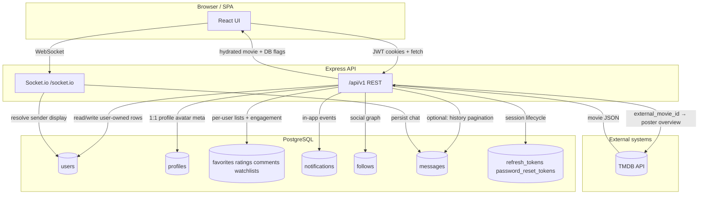

Understanding Your Database Schema: The Blueprint of Your Data

Hey there! It sounds like you're looking for a blueprint of your database, which is exactly what a UML diagram for a database schema provides. Think of it like this: if your application is a house, the database is its foundation and all the rooms within it. A database schema is the architectural plan for that foundation and rooms, defining what rooms exist (tables), what they contain (columns), and how they connect to each other (relations).

UML (Unified Modeling Language) helps us visualize this plan clearly, making it easier to understand, discuss, and maintain the database structure.

Let's dive into your database schema, based on the definitions found in apps/backend/src/db/schema.ts.

Core Database Concepts Explained

Before we look at the full picture, let's quickly go over some terms:

    Tables: These are like folders or categories for your data. For example, you'd have a users table to store information about all users, or a projects table for all projects.
    Columns: Inside each table, columns define what specific pieces of information you store. For instance, the users table might have columns like id, email, and passwordHash.
    Primary Key (PK): This is a special column (or set of columns) in a table that uniquely identifies each row. Think of it like a unique ID number for every item in that folder. In our schema, id columns are usually primary keys.
    Foreign Key (FK): This is a column in one table that refers to the primary key in another table. It's how we link related data across different tables. For example, a subscriptions table might have a userId column that links back to the id of a user in the users table, showing which user owns that subscription.
    Relations: These describe how tables are connected.
        One-to-Many (1:M): One record in a table can be linked to many records in another table. For example, one user can have many subscriptions.
        Many-to-One (M:1): The reverse of one-to-many. Many subscriptions belong to one user.
        Many-to-Many (M:M): Many records in one table can be linked to many records in another table. For example, many users can work on many projects. This usually requires an extra "junction" table to manage these connections.

Your Database Schema: The Big Picture

Here's a UML-style Entity-Relationship Diagram (ERD) showing all the main tables and how they relate to each other:

---

## UML: relational tables as entities (not HTTP requests)

**Important distinction**

| Kind of diagram | What it shows |
|-----------------|---------------|
| **UML / ER “table” diagrams** (this section, PlantUML `entity`, ASCII boxes, Mermaid `erDiagram`) | **Persistent tables**, columns inside each entity box, and **foreign-key relationships**. |
| **Data flow** (later in this doc) | **Runtime behavior**: browser → REST / WebSocket → DB. That is *not* the database schema—it can look like “requests” because it mentions `/api` and Socket.io. |

Below, each **rectangle is one SQL table**; **rows inside the rectangle are columns** (standard UML physical data model / ER notation used by CASE tools).

---

### ASCII UML table boxes (renders in any editor)

Each box is one table: header row = table name, then one line per column (`PK`, `FK`, `UK` = keys).

```
┌────────────────────────────── users ──────────────────────────────┐
│ PK  id                 SERIAL                                       │
│     name               TEXT NULL                                    │
│ UK  email              TEXT NOT NULL                                │
│     password           TEXT NOT NULL                                │
│     created_at         TIMESTAMP DEFAULT now()                      │
└─────────────────────────────────────────────────────────────────────┘
         ▲                    ▲                    ▲
         │ FK CASCADE         │ FK CASCADE         │ FK CASCADE …
         │                    │                    │
┌────────┴─────────────┐ ┌────┴─────────────────┐ ┌┴────────────────── …
│ refresh_tokens       │ │ password_reset_tokens│ │ profiles
├──────────────────────┤ ├──────────────────────┤ ├──────────────────────
│ PK  id           SERIAL│ │ PK  id           SERIAL│ │ PK  id           SERIAL
│ FK  user_id      INT   │ │ FK  user_id      INT   │ │ FK  user_id      INT UNIQUE
│ UK  token_hash   TEXT  │ │ UK  token_hash   TEXT  │ │     bio          TEXT NULL
│     expires_at   TS    │ │     expires_at   TS    │ │     avatar_url   TEXT NULL
│     created_at   TS     │ │     used_at      TS NULL│ │     location     TEXT NULL
└────────────────────────┘ │     created_at   TS     │ │     favorite_genre TEXT NULL
                           └────────────────────────┘ └────────────────────────
```

```
┌──────────────────────────── favorites ──────────────────────────────┐
│ PK  id                 SERIAL                                       │
│ FK  user_id            INTEGER NULL → users.id ON DELETE CASCADE    │
│     external_movie_id  INTEGER NOT NULL  (TMDB, not SQL FK)         │
│     added_at           TIMESTAMP DEFAULT now()                       │
└─────────────────────────────────────────────────────────────────────┘

┌───────────────────────────── ratings ───────────────────────────────┐
│ PK  id                 SERIAL                                       │
│ FK  user_id            INTEGER NULL → users.id ON DELETE CASCADE    │
│     external_movie_id  INTEGER NOT NULL  (TMDB)                     │
│     rating             INTEGER NOT NULL                              │
│     created_at         TIMESTAMP DEFAULT now()                       │
│ UK  (user_id, external_movie_id)  composite UNIQUE                   │
└─────────────────────────────────────────────────────────────────────┘

┌──────────────────────────── comments ───────────────────────────────┐
│ PK  id                 SERIAL                                       │
│ FK  user_id            INTEGER NOT NULL → users.id ON DELETE CASCADE  │
│     external_movie_id  INTEGER NOT NULL  (TMDB)                     │
│     comment            TEXT NOT NULL                                │
│     created_at         TIMESTAMP DEFAULT now()                       │
└─────────────────────────────────────────────────────────────────────┘

┌──────────────────────────── watchlists ─────────────────────────────┐
│ PK  id                 SERIAL                                       │
│ FK  user_id            INTEGER NULL → users.id ON DELETE CASCADE    │
│     external_movie_id  INTEGER NOT NULL  (TMDB)                     │
│     created_at         TIMESTAMP DEFAULT now()                       │
└─────────────────────────────────────────────────────────────────────┘
```

```
┌────────────────────────── notifications ────────────────────────────┐
│ PK  id                 SERIAL                                       │
│ FK  user_id            INTEGER NULL → users.id ON DELETE CASCADE    │
│     message            TEXT NOT NULL                                │
│     read_at            TIMESTAMP NULL                               │
│     created_at         TIMESTAMP DEFAULT now()                       │
│     link_type          TEXT NULL                                    │
│     target_id          INTEGER NULL  (logical, no FK)               │
└─────────────────────────────────────────────────────────────────────┘

┌──────────────────────────── follows ────────────────────────────────┐
│ FK  follower_id        INTEGER NOT NULL → users.id ON DELETE CASCADE│
│ FK  following_id       INTEGER NOT NULL → users.id ON DELETE CASCADE│
│     created_at         TIMESTAMP NOT NULL DEFAULT now()             │
│ UK  (follower_id, following_id)  composite UNIQUE                   │
└─────────────────────────────────────────────────────────────────────┘

┌──────────────────────────── messages ───────────────────────────────┐
│ PK  id                 SERIAL                                       │
│ FK  sender_id          INTEGER NULL → users.id ON DELETE SET NULL   │
│     room_id            TEXT NOT NULL  (Socket room, not SQL FK)    │
│     content            TEXT NOT NULL                                │
│     created_at         TIMESTAMP NOT NULL DEFAULT now()             │
└─────────────────────────────────────────────────────────────────────┘
```

**How to read the arrows in the first sketch:** they mean **referential integrity** (`user_id` points at `users.id`), not REST routes.

---

### PlantUML — standard UML entity / ER notation (columns inside each table)

Paste into [PlantUML Web Server](https://www.plantuml.com/plantuml/uml/), VS Code “PlantUML” extension, or your CI renderer. Each `entity` block is one **database table**; `*` = part of identifier or required field; `..` = separator line inside the entity.

```plantuml
@startuml CinéConnect_schema_tables_UML
!theme plain
skinparam linetype ortho
hide circle
skinparam roundcorner 5
skinparam entity {
  BackgroundColor White
  BorderColor Black
}

title CinéConnect — UML physical data model (tables = entities)

entity "users" as users {
  * **id** : serial <<PK>>
  --
  name : text <<NULL>>
  * email : text <<UNIQUE NOT NULL>>
  * password : text <<NOT NULL>>
  created_at : timestamp <<default now>>
}

entity "refresh_tokens" as refresh_tokens {
  * **id** : serial <<PK>>
  --
  * **user_id** : integer <<FK → users.id CASCADE>>
  * token_hash : text <<UNIQUE NOT NULL>>
  * expires_at : timestamp <<NOT NULL>>
  created_at : timestamp <<default now>>
  ..
  {index} user_id
}

entity "password_reset_tokens" as password_reset_tokens {
  * **id** : serial <<PK>>
  --
  * **user_id** : integer <<FK → users.id CASCADE>>
  * token_hash : text <<UNIQUE NOT NULL>>
  * expires_at : timestamp <<NOT NULL>>
  used_at : timestamp <<NULL>>
  created_at : timestamp <<default now>>
  ..
  {index} user_id
}

entity "profiles" as profiles {
  * **id** : serial <<PK>>
  --
  * **user_id** : integer <<FK UNIQUE → users.id CASCADE 1:1>>
  bio : text <<NULL>>
  avatar_url : text <<NULL>>
  location : text <<NULL>>
  favorite_genre : text <<NULL>>
}

entity "favorites" as favorites {
  * **id** : serial <<PK>>
  --
  user_id : integer <<NULL FK → users.id CASCADE>>
  * external_movie_id : integer <<NOT NULL TMDB logical>>
  added_at : timestamp <<default now>>
}

entity "ratings" as ratings {
  * **id** : serial <<PK>>
  --
  user_id : integer <<NULL FK → users.id CASCADE>>
  * external_movie_id : integer <<NOT NULL TMDB logical>>
  * rating : integer <<NOT NULL>>
  created_at : timestamp <<default now>>
  ..
  {UNIQUE} (user_id, external_movie_id)
}

entity "comments" as comments {
  * **id** : serial <<PK>>
  --
  * **user_id** : integer <<FK → users.id CASCADE>>
  * external_movie_id : integer <<NOT NULL TMDB logical>>
  * comment : text <<NOT NULL>>
  created_at : timestamp <<default now>>
}

entity "watchlists" as watchlists {
  * **id** : serial <<PK>>
  --
  user_id : integer <<NULL FK → users.id CASCADE>>
  * external_movie_id : integer <<NOT NULL TMDB logical>>
  created_at : timestamp <<default now>>
}

entity "notifications" as notifications {
  * **id** : serial <<PK>>
  --
  user_id : integer <<NULL FK → users.id CASCADE>>
  * message : text <<NOT NULL>>
  read_at : timestamp <<NULL>>
  created_at : timestamp <<default now>>
  link_type : text <<NULL>>
  target_id : integer <<NULL logical>>
}

entity "follows" as follows {
  * **follower_id** : integer <<FK → users.id CASCADE>>
  * **following_id** : integer <<FK → users.id CASCADE>>
  --
  * created_at : timestamp <<NOT NULL default now>>
  ..
  {UNIQUE} (follower_id, following_id)
}

entity "messages" as messages {
  * **id** : serial <<PK>>
  --
  sender_id : integer <<NULL FK → users.id ON DELETE SET NULL>>
  * room_id : text <<NOT NULL logical Socket room>>
  * content : text <<NOT NULL>>
  * created_at : timestamp <<NOT NULL default now>>
  ..
  {index} (room_id, created_at)
}

users ||--o{ refresh_tokens
users ||--o{ password_reset_tokens
users ||--o| profiles
users ||--o{ favorites
users ||--o{ ratings
users ||--o{ comments
users ||--o{ watchlists
users ||--o{ notifications
users ||--o{ follows
users ||--o{ messages

note right of follows : Both follower_id and following_id are FKs to users.id

@enduml
```



**Rendering tip:** If the diagram is too tall, split into two `@startuml` blocks (e.g. “auth + profile” and “movies + social + chat”) and keep the same `entity` definitions—relationships only between tables in that file.

---

## PostgreSQL DDL reference (SQL editor style)

The script below is the **logical PostgreSQL shape** of `apps/backend/src/db/schema.ts`. Actual migration SQL may name constraints slightly differently (Drizzle Kit); use `pnpm --filter backend db:generate` after schema edits. Run fragments in pgAdmin, DBeaver, DataGrip, or `psql` to reason about types and FK behavior.

```sql
-- =============================================================================
-- extensions (if needed by your cluster)
-- =============================================================================
-- CREATE EXTENSION IF NOT EXISTS "uuid-ossp";

-- =============================================================================
-- users — root identity
-- =============================================================================
CREATE TABLE users (
    id          SERIAL PRIMARY KEY,
    name        TEXT,
    email       TEXT NOT NULL UNIQUE,
    password    TEXT NOT NULL,
    created_at  TIMESTAMP DEFAULT NOW()
);

-- =============================================================================
-- auth tokens (hashed at rest)
-- =============================================================================
CREATE TABLE refresh_tokens (
    id           SERIAL PRIMARY KEY,
    user_id      INTEGER NOT NULL REFERENCES users (id) ON DELETE CASCADE,
    token_hash   TEXT NOT NULL UNIQUE,
    expires_at   TIMESTAMP NOT NULL,
    created_at   TIMESTAMP DEFAULT NOW()
);
CREATE INDEX refresh_tokens_user_id_idx ON refresh_tokens (user_id);

CREATE TABLE password_reset_tokens (
    id           SERIAL PRIMARY KEY,
    user_id      INTEGER NOT NULL REFERENCES users (id) ON DELETE CASCADE,
    token_hash   TEXT NOT NULL UNIQUE,
    expires_at   TIMESTAMP NOT NULL,
    used_at      TIMESTAMP,
    created_at   TIMESTAMP DEFAULT NOW()
);
CREATE INDEX password_reset_tokens_user_id_idx ON password_reset_tokens (user_id);

-- =============================================================================
-- profile (1:1 with users via UNIQUE user_id)
-- =============================================================================
CREATE TABLE profiles (
    id              SERIAL PRIMARY KEY,
    user_id         INTEGER NOT NULL UNIQUE REFERENCES users (id) ON DELETE CASCADE,
    bio             TEXT,
    avatar_url      TEXT,
    location        TEXT,
    favorite_genre  TEXT
);

-- =============================================================================
-- TMDB movie id (logical FK to TMDB only — no movies table in this DB)
-- =============================================================================
CREATE TABLE favorites (
    id                  SERIAL PRIMARY KEY,
    user_id             INTEGER REFERENCES users (id) ON DELETE CASCADE,
    external_movie_id   INTEGER NOT NULL,
    added_at            TIMESTAMP DEFAULT NOW()
);

CREATE TABLE ratings (
    id                  SERIAL PRIMARY KEY,
    user_id             INTEGER REFERENCES users (id) ON DELETE CASCADE,
    external_movie_id   INTEGER NOT NULL,
    rating              INTEGER NOT NULL,
    created_at          TIMESTAMP DEFAULT NOW(),
    UNIQUE (user_id, external_movie_id)
);

CREATE TABLE comments (
    id                  SERIAL PRIMARY KEY,
    user_id             INTEGER NOT NULL REFERENCES users (id) ON DELETE CASCADE,
    external_movie_id   INTEGER NOT NULL,
    comment             TEXT NOT NULL,
    created_at          TIMESTAMP DEFAULT NOW()
);

CREATE TABLE watchlists (
    id                  SERIAL PRIMARY KEY,
    user_id             INTEGER REFERENCES users (id) ON DELETE CASCADE,
    external_movie_id   INTEGER NOT NULL,
    created_at          TIMESTAMP DEFAULT NOW()
);

-- =============================================================================
-- notifications + social + chat
-- =============================================================================
CREATE TABLE notifications (
    id          SERIAL PRIMARY KEY,
    user_id     INTEGER REFERENCES users (id) ON DELETE CASCADE,
    message     TEXT NOT NULL,
    read_at     TIMESTAMP,
    created_at  TIMESTAMP DEFAULT NOW(),
    link_type   TEXT,
    target_id   INTEGER
);

CREATE TABLE follows (
    follower_id   INTEGER NOT NULL REFERENCES users (id) ON DELETE CASCADE,
    following_id  INTEGER NOT NULL REFERENCES users (id) ON DELETE CASCADE,
    created_at    TIMESTAMP NOT NULL DEFAULT NOW(),
    UNIQUE (follower_id, following_id)
);

CREATE TABLE messages (
    id          SERIAL PRIMARY KEY,
    sender_id   INTEGER REFERENCES users (id) ON DELETE SET NULL,
    room_id     TEXT NOT NULL,
    content     TEXT NOT NULL,
    created_at  TIMESTAMP NOT NULL DEFAULT NOW()
);
CREATE INDEX messages_room_id_created_at_idx ON messages (room_id, created_at);
```

---

## Column catalogue (grid per table)

Same information as a **table inspector** in a SQL client: column name, PostgreSQL-style type, nullability, default, and how it relates to other tables.

### `users`

| Column | Type | Nullable | Default | Constraints / relations |
|--------|------|----------|---------|-------------------------|
| `id` | `integer` / `serial` | NO | auto | **PK** |
| `name` | `text` | YES | — | — |
| `email` | `text` | NO | — | **UNIQUE** |
| `password` | `text` | NO | — | stored hash |
| `created_at` | `timestamp` | YES | `now()` | — |

**Referenced by (FK → `users.id`):** all tables below except none point *to* users from outside users.

---

### `refresh_tokens`

| Column | Type | Nullable | Default | Constraints / relations |
|--------|------|----------|---------|-------------------------|
| `id` | `serial` | NO | auto | **PK** |
| `user_id` | `integer` | NO | — | **FK → `users.id` ON DELETE CASCADE** |
| `token_hash` | `text` | NO | — | **UNIQUE** (SHA-256 of opaque token) |
| `expires_at` | `timestamp` | NO | — | — |
| `created_at` | `timestamp` | YES | `now()` | — |

**Index:** `refresh_tokens_user_id_idx` on `user_id`.

---

### `password_reset_tokens`

| Column | Type | Nullable | Default | Constraints / relations |
|--------|------|----------|---------|-------------------------|
| `id` | `serial` | NO | auto | **PK** |
| `user_id` | `integer` | NO | — | **FK → `users.id` ON DELETE CASCADE** |
| `token_hash` | `text` | NO | — | **UNIQUE** |
| `expires_at` | `timestamp` | NO | — | — |
| `used_at` | `timestamp` | YES | — | set when token consumed |
| `created_at` | `timestamp` | YES | `now()` | — |

**Index:** `password_reset_tokens_user_id_idx` on `user_id`.

---

### `profiles`

| Column | Type | Nullable | Default | Constraints / relations |
|--------|------|----------|---------|-------------------------|
| `id` | `serial` | NO | auto | **PK** |
| `user_id` | `integer` | NO | — | **FK → `users.id` ON DELETE CASCADE**, **UNIQUE** → 1:1 user |
| `bio` | `text` | YES | — | — |
| `avatar_url` | `text` | YES | — | often `/uploads/avatars/...` |
| `location` | `text` | YES | — | — |
| `favorite_genre` | `text` | YES | — | — |

---

### `favorites`

| Column | Type | Nullable | Default | Constraints / relations |
|--------|------|----------|---------|-------------------------|
| `id` | `serial` | NO | auto | **PK** |
| `user_id` | `integer` | YES | — | **FK → `users.id` ON DELETE CASCADE** |
| `external_movie_id` | `integer` | NO | — | **logical TMDB id** (no FK in DB) |
| `added_at` | `timestamp` | YES | `now()` | — |

---

### `ratings`

| Column | Type | Nullable | Default | Constraints / relations |
|--------|------|----------|---------|-------------------------|
| `id` | `serial` | NO | auto | **PK** |
| `user_id` | `integer` | YES | — | **FK → `users.id` ON DELETE CASCADE** |
| `external_movie_id` | `integer` | NO | — | **logical TMDB id** |
| `rating` | `integer` | NO | — | app-validated score |
| `created_at` | `timestamp` | YES | `now()` | — |

**Constraint:** **UNIQUE (`user_id`, `external_movie_id`)** — one row per user per movie.

---

### `comments`

| Column | Type | Nullable | Default | Constraints / relations |
|--------|------|----------|---------|-------------------------|
| `id` | `serial` | NO | auto | **PK** |
| `user_id` | `integer` | NO | — | **FK → `users.id` ON DELETE CASCADE** |
| `external_movie_id` | `integer` | NO | — | **logical TMDB id** |
| `comment` | `text` | NO | — | — |
| `created_at` | `timestamp` | YES | `now()` | — |

---

### `watchlists`

| Column | Type | Nullable | Default | Constraints / relations |
|--------|------|----------|---------|-------------------------|
| `id` | `serial` | NO | auto | **PK** |
| `user_id` | `integer` | YES | — | **FK → `users.id` ON DELETE CASCADE** |
| `external_movie_id` | `integer` | NO | — | **logical TMDB id** |
| `created_at` | `timestamp` | YES | `now()` | — |

---

### `notifications`

| Column | Type | Nullable | Default | Constraints / relations |
|--------|------|----------|---------|-------------------------|
| `id` | `serial` | NO | auto | **PK** |
| `user_id` | `integer` | YES | — | **FK → `users.id` ON DELETE CASCADE** |
| `message` | `text` | NO | — | — |
| `read_at` | `timestamp` | YES | — | null = unread |
| `created_at` | `timestamp` | YES | `now()` | — |
| `link_type` | `text` | YES | — | e.g. `"profile"` / `"movie"` (app convention) |
| `target_id` | `integer` | YES | — | **logical** target (no FK) |

---

### `follows`

| Column | Type | Nullable | Default | Constraints / relations |
|--------|------|----------|---------|-------------------------|
| `follower_id` | `integer` | NO | — | **FK → `users.id` ON DELETE CASCADE** |
| `following_id` | `integer` | NO | — | **FK → `users.id` ON DELETE CASCADE** |
| `created_at` | `timestamp` | NO | `now()` | — |

**Constraint:** **UNIQUE (`follower_id`, `following_id`)** — one edge per pair; composite identity of the row.

---

### `messages`

| Column | Type | Nullable | Default | Constraints / relations |
|--------|------|----------|---------|-------------------------|
| `id` | `serial` | NO | auto | **PK** |
| `sender_id` | `integer` | YES | — | **FK → `users.id` ON DELETE SET NULL** |
| `room_id` | `text` | NO | — | e.g. `global`, `film:550` (**not** an SQL FK) |
| `content` | `text` | NO | — | — |
| `created_at` | `timestamp` | NO | `now()` | — |

**Index:** `messages_room_id_created_at_idx` on (`room_id`, `created_at`).

---

## Foreign-key relationship map (not HTTP / not “requests”)

This is still a **structural** view: **ovals/cards = table names**, **arrows = foreign keys** in the database. It is **not** a sequence of API calls (no `/api` steps here). For **columns inside each table**, [see the column catalogue](./imgs/10-Dadtabase_Tables/Database-tables.png).
**Legend**

- **Solid arrow:** PostgreSQL foreign key.
- **Dashed arrow:** Application-level / logical reference only (`external_movie_id`, `room_id`, `notifications.target_id`).

---

## Full entity–relationship diagram (all columns + FK relations)

**Mermaid `erDiagram`:** every table lists **all columns** with nullability and key role. Relationships use crow’s-foot notation; edge labels show `ON DELETE` where it is not cascade.

Cardinality: `||` = one, `o{` = zero or more, `o|` = zero or one.

```mermaid
erDiagram
    users {
        serial id PK
        text name "NULL"
        text email "NOT NULL UK"
        text password "NOT NULL"
        timestamp created_at "DEFAULT now"
    }

    refresh_tokens {
        serial id PK
        int user_id "NOT NULL FK"
        text token_hash "NOT NULL UK"
        timestamp expires_at "NOT NULL"
        timestamp created_at "DEFAULT now"
    }

    password_reset_tokens {
        serial id PK
        int user_id "NOT NULL FK"
        text token_hash "NOT NULL UK"
        timestamp expires_at "NOT NULL"
        timestamp used_at "NULL"
        timestamp created_at "DEFAULT now"
    }

    profiles {
        serial id PK
        int user_id "NOT NULL FK UK"
        text bio "NULL"
        text avatar_url "NULL"
        text location "NULL"
        text favorite_genre "NULL"
    }

    favorites {
        serial id PK
        int user_id "NULL FK"
        int external_movie_id "NOT NULL TMDB"
        timestamp added_at "DEFAULT now"
    }

    ratings {
        serial id PK
        int user_id "NULL FK"
        int external_movie_id "NOT NULL TMDB"
        int rating "NOT NULL"
        timestamp created_at "DEFAULT now"
    }

    comments {
        serial id PK
        int user_id "NOT NULL FK"
        int external_movie_id "NOT NULL TMDB"
        text comment "NOT NULL"
        timestamp created_at "DEFAULT now"
    }

    watchlists {
        serial id PK
        int user_id "NULL FK"
        int external_movie_id "NOT NULL TMDB"
        timestamp created_at "DEFAULT now"
    }

    notifications {
        serial id PK
        int user_id "NULL FK"
        text message "NOT NULL"
        timestamp read_at "NULL"
        timestamp created_at "DEFAULT now"
        text link_type "NULL"
        int target_id "NULL logical"
    }

    follows {
        int follower_id "NOT NULL FK part of UNIQUE"
        int following_id "NOT NULL FK part of UNIQUE"
        timestamp created_at "NOT NULL DEFAULT now"
    }

    messages {
        serial id PK
        int sender_id "NULL FK SET NULL"
        text room_id "NOT NULL"
        text content "NOT NULL"
        timestamp created_at "NOT NULL DEFAULT now"
    }

    users ||--o{ refresh_tokens : "ON DELETE CASCADE"
    users ||--o{ password_reset_tokens : "ON DELETE CASCADE"
    users ||--o| profiles : "1:1 CASCADE"
    users ||--o{ favorites : "ON DELETE CASCADE"
    users ||--o{ ratings : "ON DELETE CASCADE"
    users ||--o{ comments : "ON DELETE CASCADE"
    users ||--o{ watchlists : "ON DELETE CASCADE"
    users ||--o{ notifications : "ON DELETE CASCADE"
    users ||--o{ follows : "follower CASCADE"
    users ||--o{ follows : "following CASCADE"
    users ||--o{ messages : "ON DELETE SET NULL"
```



**Diagram notes**

- **`ratings`:** composite **UNIQUE (`user_id`, `external_movie_id`)** — see DDL and column catalogue (Mermaid lists columns only inside the entity block).
- **`follows`:** no surrogate `id`; row identity = pair (`follower_id`, `following_id`) under **UNIQUE**.
- **`external_movie_id` / `room_id` / `target_id`:** shown as columns on entities but **no ER line** to a movie table—TMDB is outside the database.

---

## UML class diagram (full attributes + associations)

Same schema as **UML classes** (attributes + multiplicities). Associations mirror FKs.

```mermaid
classDiagram
    direction TB

    class Users {
        +id: serial <<PK>>
        name: text <<nullable>>
        email: text <<NOT NULL UNIQUE>>
        password: text <<NOT NULL>>
        createdAt: timestamp <<default now>>
    }

    class RefreshTokens {
        +id: serial <<PK>>
        userId: integer <<NOT NULL FK>>
        tokenHash: text <<NOT NULL UNIQUE>>
        expiresAt: timestamp <<NOT NULL>>
        createdAt: timestamp
    }

    class PasswordResetTokens {
        +id: serial <<PK>>
        userId: integer <<NOT NULL FK>>
        tokenHash: text <<NOT NULL UNIQUE>>
        expiresAt: timestamp <<NOT NULL>>
        usedAt: timestamp <<nullable>>
        createdAt: timestamp
    }

    class Profiles {
        +id: serial <<PK>>
        userId: integer <<NOT NULL FK UNIQUE>>
        bio: text
        avatarUrl: text
        location: text
        favoriteGenre: text
    }

    class Favorites {
        +id: serial <<PK>>
        userId: integer <<nullable FK>>
        externalMovieId: integer <<NOT NULL TMDB>>
        addedAt: timestamp
    }

    class Ratings {
        +id: serial <<PK>>
        userId: integer <<nullable FK>>
        externalMovieId: integer <<NOT NULL TMDB>>
        rating: integer <<NOT NULL>>
        createdAt: timestamp
        <<UNIQUE userId + externalMovieId>>
    }

    class Comments {
        +id: serial <<PK>>
        userId: integer <<NOT NULL FK>>
        externalMovieId: integer <<NOT NULL TMDB>>
        comment: text <<NOT NULL>>
        createdAt: timestamp
    }

    class Watchlists {
        +id: serial <<PK>>
        userId: integer <<nullable FK>>
        externalMovieId: integer <<NOT NULL TMDB>>
        createdAt: timestamp
    }

    class Notifications {
        +id: serial <<PK>>
        userId: integer <<nullable FK>>
        message: text <<NOT NULL>>
        readAt: timestamp
        createdAt: timestamp
        linkType: text
        targetId: integer <<logical>>
    }

    class Follows {
        followerId: integer <<NOT NULL FK part of UNIQUE>>
        followingId: integer <<NOT NULL FK part of UNIQUE>>
        createdAt: timestamp <<NOT NULL>>
    }

    class Messages {
        +id: serial <<PK>>
        senderId: integer <<nullable FK onDelete set null>>
        roomId: text <<NOT NULL>>
        content: text <<NOT NULL>>
        createdAt: timestamp <<NOT NULL>>
    }

    Users "1" --> "0..*" RefreshTokens : user_id CASCADE
    Users "1" --> "0..*" PasswordResetTokens : user_id CASCADE
    Users "1" --> "0..1" Profiles : user_id CASCADE UNIQUE
    Users "1" --> "0..*" Favorites : user_id CASCADE
    Users "1" --> "0..*" Ratings : user_id CASCADE
    Users "1" --> "0..*" Comments : user_id CASCADE
    Users "1" --> "0..*" Watchlists : user_id CASCADE
    Users "1" --> "0..*" Notifications : user_id CASCADE
    Users "1" --> "0..*" Follows : follower_id
    Users "1" --> "0..*" Follows : following_id
    Users "1" --> "0..*" Messages : sender_id SET NULL
```



---

## Relation matrix (quick reference)

| Child table | FK column(s) | Parent | Cardinality | onDelete |
|-------------|----------------|--------|-------------|----------|
| `refresh_tokens` | `user_id` | `users.id` | M:1 | cascade |
| `password_reset_tokens` | `user_id` | `users.id` | M:1 | cascade |
| `profiles` | `user_id` (unique) | `users.id` | 1:1 | cascade |
| `favorites` | `user_id` | `users.id` | M:1 | cascade |
| `ratings` | `user_id` | `users.id` | M:1 | cascade |
| `comments` | `user_id` | `users.id` | M:1 | cascade |
| `watchlists` | `user_id` | `users.id` | M:1 | cascade |
| `notifications` | `user_id` | `users.id` | M:1 | cascade |
| `follows` | `follower_id`, `following_id` | `users.id` (×2) | M:N via junction | cascade |
| `messages` | `sender_id` | `users.id` | M:1 | **set null** |

**Logical-only (no FK in DB)**

- `favorites`, `ratings`, `comments`, `watchlists`: `external_movie_id` → TMDB movie (runtime fetch from API).
- `messages.room_id` → Socket.io room string (e.g. `global`, `film:550`); not a SQL FK.
- `notifications.link_type` + `target_id` → in-app navigation hints; not FK-enforced.

---

## Data flow: app, database, and TMDB (runtime — not UML tables)

This section describes **runtime / request flow** (browser, REST, WebSocket, TMDB). It is **not** a replacement for the **UML table diagrams** at the top: those show **where data is stored** (relational entities); this shows **how the app talks to services** during operation.



**Flow summary**

1. **Auth:** Register/login writes `users`; refresh rotation writes `refresh_tokens`; logout clears cookies (DB row may remain until expiry). Password reset uses `password_reset_tokens`.
2. **Profile:** `profiles` and file-based avatars (`avatar_url` / uploads) stay in sync via user endpoints.
3. **Movies:** Client and API use **`external_movie_id` (TMDB)**. PostgreSQL stores only ids and user actions; **titles/posters come from TMDB** on each request (or cached in memory by the service layer — not a separate `movies` table in this schema).
4. **Social:** `follows` links two `users` rows. Notifications may reference another user or a movie id in `target_id` for deep links.
5. **Chat:** Live traffic goes through Socket.io; **`messages`** is the durable log keyed by `room_id` + time; `sender_id` links to `users` when the user is authenticated.

---

## Indexes (performance, not relations)

| Object | Columns | Purpose |
|--------|---------|--------|
| `refresh_tokens_user_id_idx` | `user_id` | Look up tokens per user |
| `password_reset_tokens_user_id_idx` | `user_id` | Look up reset rows per user |
| `messages_room_id_created_at_idx` | `room_id`, `created_at` | Room history + pagination order |

---

## Exporting to other UML / ER tools

- **Mermaid Live Editor:** paste any ` ```mermaid ` block to export SVG/PNG.
- **PlantUML / draw.io / dbdiagram.io:** you can translate from the **DDL section** above (dbdiagram.io accepts SQL-like definitions) for a studio-quality ERD.

---

*Source of truth: `apps/backend/src/db/schema.ts` (Drizzle). Regenerate migrations with `pnpm --filter backend db:generate` after schema changes.*
